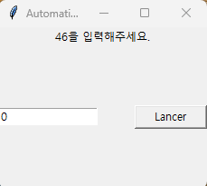

# Salaisons de la Brèche 생산 계획서 자동화

## 소개
>회사는 매주 수요일 마다 재고서를 참고하여 생산 계획서를 작성해 제품 제조팀에게 넘겨줘야 합니다.  
> 문제는 재고서가 깔끔하게 정리되어 있지 않기 때문에 각 제품마다 일일이 계산하는 일이 시간이 걸립니다.  
> 
> 이런 노고를 덜기 위해서, 자동화 프로그램을 만들었습니다.

<br />

## 사용한 기술

- Python: 3.11
<br />
<br />
- Xlwings
<br />
<br />
- tkinter
<br />
<br />
- pyautogui

<br />

## 핵심 코드

이 자동화 프로그램 코드는 엑셀로 된 재고서를 연 뒤 데이터를 가져와 파이썬 코드로 된 계산식을 실행합니다.  

생산 계획서는 5개의 품목을 계산하는데, 품목의 데이터는 다르지만 계산식은 5개가 비슷합니다.

첫번째 품목인 Halal 품목의 코드만 보여드리겠습니다.

<details>
<summary><b>코드 보기</b></summary>

```python
planning_path = f'Semaine {entry.get()} - Planning Fabrication.xlsm'
save_path = f'Semaine {entry.get()} - Planning Fabrication.xlsm'
stock_path = 'Stock Produits finis.xlsm'
```
먼저 생산 계획서 경로, 저장 경로, 재고서 경로를 정의했습니다.

<br />

xlwings을 사용해 생산 계획서에 작성할 시트를 열고, 재고서의 Halal 시트도 열어줬습니다.
```python
    with xw.App(visible=False) as app:
        planning_wb = xw.Book(planning_path)
        stock_wb = xw.Book(stock_path)

        planning_ws = planning_wb.sheets[0]

        # Halal
        halal = stock_wb.sheets[1]
```

<br />

재고서의 Halal 데이터를 가져와 리스트 형식으로 넣어줬습니다.
```python
halal_data = [halal['AK28'].value, halal['AK51'].value, halal['AK84'].value, halal['AK116'].value] 

        halal_s = [4, 4, 8, 8]
        halal_total = [
            halal['R28'].value,
            halal['R51'].value,
            halal['R85'].value,
            halal['R117'].value,
        ]
        halal_melee = [
            (halal['AK25'].value * halal['AA25'].value),
            (halal['AK48'].value * halal['AA48'].value), 
            (halal['AK82'].value * halal['AA82'].value), 
            (halal['AK114'].value * halal['AA114'].value), 
            ]
        halal_m = [
            halal['AA25'].value,
            halal['AA48'].value,
            halal['AA82'].value,
            halal['AA114'].value,
        ]
        halal_planning_s_en_cours = [
            planning_ws['F7'].value,
            planning_ws['F8'].value,
            planning_ws['F11'].value,
            planning_ws['F12'].value,
        ]
```
그런 다음 for 문을 사용해 리스트에 들어있는 각 데이터 마다 계산식을 실행시켰습니다.
```python
data = []
        for i in range(len(halal_data)):
            if halal_data[i] >= halal_s[i]:
                x = 0
                data.append(x)
            else:
                y = halal_s[i] * halal_melee[i] + halal_melee[i] - halal_total[i]
                x = y / halal_m[i]
                x = round(x, 1)
                z = math.ceil(x)
                if (z * 10) - (x * 10) >= 5:
                    data.append(z - 0.5)
                elif z == 0:
                    z = 0.5
                    data.append(z)
                else:
                    data.append(z)
```

<br />

계산식을 실행한 데이터들은 for 구문을 이용해 생산 계획서에 넣어줍니다.
```python
order = [7, 8, 11, 12]
        for i in range(len(halal_data)):
            if halal_planning_s_en_cours[i] >= data[i]:
                planning_ws[f'E{order[i]}'].value = 0
            else:
                planning_ws[f'E{order[i]}'].value = data[i] - halal_planning_s_en_cours[i]
        print("halal good")
```
코드가 모두 잘 실행되면 halal good 이라는 print를 띄어 halal 코드에는 문제가 없다는 것을 나타냅니다.

<br />

이제 이 프로그램을 실행시킬 GUI를 만들어 줍니다.  
tkinter를 사용했습니다.

```python
root = Tk()
root.title('Automatisation de planning de fabrication')
label = Label(root, text='46을 입력해주세요.')
label_vide = Label(root, text='', width=5, height=10)
entry = Entry(root, width=15)
btn = Button(root, width=10 ,text='Lancer')
label.grid(row=0, column=0, columnspan=3)
label_vide.grid(row=1, column=0)
label_vide.grid(row=1, column=1)
label_vide.grid(row=1, column=2)
entry.grid(row=2, column=0)
label_vide.grid(row=2,column=1)
btn.grid(row=2, column=2)

entry.insert(0, int())
```



<br />
<br />

아까 계산식을 실행시킨 코드들을 automatiser 라는 하나의 함수로 만든 뒤,  
프로그램을 실행시키면 확인 또는 취소를 선택할 수 있는 메세지 박스를 띄우게 했습니다.

```python
def check_automatiser(event):
    if askyesno(title='Confirmation', message='Vous voulez lancer le programme ?'):
        try:
            automatiser()
        except Exception as e:
            print(e)
            pyautogui.alert('실패!')

btn.bind('<Button-1>', check_automatiser)
root.mainloop()
```

프로그램을 실행하면서 에러가 발생하면 '실패' 메세지 박스가 나타나도록 했습니다.

모든 코드가 잘 동작해 실행되면 '성공' 이라는 메세지 박스가 보여집니다. 
</details>

<br />

## 에러 처리 경험

계산식을 사용해 코드를 작성했기 때문에 테스트를 하면서 많은 에러가 있었지만 계산식을 수정해 여러번 시도하니 해결이 안되는 코드는 없었습니다.

문제는 xlwings를 사용하기 전에 보편적으로 사용하는 openpyxl를 사용했을 때입니다.

재고서에는 VBA코드를 사용해 매크로를 만들어 둔 것이 있었는데, openpyxl를 사용한 자동화 코드를 실행하면 항상 매크로가 사라진다는 것이었습니다.

열심히 구글링도 해보고 openpyxl 라이브러리 페이지에서 방법을 찾아봤지만 저의 문제는 해결하지 못했습니다.

그래서 엑셀 매크로를 보존할 수 있는 파이썬 엑셀 라이브러리를 찾아보니 xlwings라는 매크로를 삭제하지 않고도 프로그램 실행이 정상적으로 동작하게 해주는 것 같아 
xlwings를 openpyxl 대신 사용하게 되었습니다.